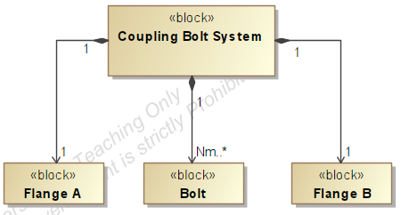
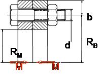

# Benchmark exercise MBADS for System Sizing: Coupling bolt

## 1. Introduction

This benchmark exercise aims to evaluate - competitive or complementary - contributions claiming to improve the Model-Based Architecture Design Synthesis (MBADS) process for system sizing. 

In this benchmark exercise, the overall objective of the Model-Based Architecture Design Synthesis Process is to size the Coupling Bolt System defined in Section 2. The candidate solutions can support an engineer throughout the end-to-end MBADS process or for a specific activity.

Section 3 specifies the design inputs for each activity of the MBADS process. All candidate solutions must reuse these design inputs to make fair comparisons.

- Section 3.1 defines the inputs of the Requirements Development activity.
- Section 3.2 defines the inputs of the Concept Finding activity.
- Section 3.3 defines the inputs of the Problem Modelling activity.
- Section 3.4 defines the inputs of the Problem Solving activity.

## 2. System-Of-Interest

The system-of-interest is a Coupling Bolt System. A Coupling Bolt System is a mechanical means of holding two halves of a flanged shaft together to transfer the torque while maintaining shaft alignment.

## 3. Design Inputs

The design inputs are defined in a generic format, leaving the contributors the choice to use any modelling language and software to encode the data.

### *3.1. Requirements Development*

- [ ] **Design Inputs:**
  - 1..* system functions
  - 1 system context
  - 1 system architecture
- [ ] **Design Outputs:**

  - 1..* requirements

  - 1..* design constraints

**Coupling Bolt System Functions**

The Coupling Bolt System shall perform two functions:

|  ID  | Function                                                     |
| :--: | ------------------------------------------------------------ |
|  F1  | To hold two halves of a flanged shaft together to transfer the torque. |
|  F2  | To maintain shaft alignment.                                 |

**Coupling Bolt System Architecture**

### *3.2. Concept Finding*

- [ ] **Design Inputs:**

  - 1..* requirements

  - 1..* design constraints

- [ ] **Design Outputs:**
  - 1..* system configuration
  - Preliminary set of typed design variables with their range of acceptable values (e.g., min and/or max real number, Boolean, enumeration).
  - Preliminary set of design parameters, each with a fixed value set after a design synthesis iteration.
  - Preliminary set of constants, each with its unmodifiable value.
  - Preliminary set of relationships between design variables, design parameters, and constants

**Coupling Bolt System Requirements**

| ID   | Statement                                                    |
| ---- | ------------------------------------------------------------ |
| SR1  | The coupling bolt system shall transfer a torque greater than or equal to 400 000 N.mm. |
| SR2  | The coupling bolt system shall maintain the shaft alignment . |

**Coupling Bolt System Design Constraints**

| ID   | Statement                                                 |
| ---- | --------------------------------------------------------- |
| C1   | The coupling bolt system must be purely mechanical.       |
| C2   | The cost of the coupling bolt system must be minimized.   |
| C3   | The weight of the coupling bolt system must be minimized. |
| C4   | The diameter of the shaft is equal to 50 mm.              |

### *3.3. Problem Modelling*

- [ ] **Design Inputs:**
  - 1..* system configuration
  - Preliminary set of constants, each with its unmodifiable value.
  - Preliminary set of typed design variables with their range of acceptable values (e.g., min and/or max real number, Boolean, enumeration).
  - Preliminary set of design parameters, each with a fixed value set after a design synthesis iteration.
  - Preliminary set of relationships between design variables, design parameters, and constants.

- [ ] **Design Outputs:**
  
  - Complete set of design variables, design parameters, and constants.
  
  - Complete set of relationships between design variables, design parameters, and constants.

**Coupling Bolt System Configuration**

The Coupling Bolt System configuration is known in advance as the objective of the MBADS is system sizing. As shown below, the Coupling Bolt System includes at least one bolt and one shaft, and exactly one material.

**Preliminary Set of Constants**

| Name | Data Type | Domain | Unit | Definition |
| :--: | :-------: | :----: | :--: | :--------: |
|      |           |        |      |            |

**Preliminary Set of Design Parameters**

| Name |   Data Type   |  Domain  | Unit |          Definition           |
| :--: | :-----------: | :------: | :--: | :---------------------------: |
|  Mt  | Positive real | 40 00 00 | N.mm |  Minimum torque to transfer   |
|  Nm  | Positive real |    8     |  -   |    Minimum number of bolts    |
|  ep  | Positive real |    10    |  mm  |           Thickness           |
|  Rm  | Positive real |    50    |  mm  | Radius of housing shafts (mm) |

**Preliminary Set of Design Variables**

|  Name  |    Data Type     |     Domain     | Unit |               Definition               |
| :----: | :--------------: | :------------: | :--: | :------------------------------------: |
|   N    | Positive integer | [\| Nm, 100\|] |  -   |            Number of bolts             |
|   R    |  Positive real   |   [10;1050]    |  mm  |            Coupling radius             |
|   Rb   |  Positive real   |    [5;1000]    |  mm  |              Bolt radius               |
|   b    |  Positive real   |     [5;50]     |      |  Radial width of the contact surface   |
|   s    |  Positive real   |    [1;100]     |  mm  |         Distance between bolts         |
|  Bref  | Positive integer | Cf Table below |  -   |             Bolt reference             |
| Maccou |  Positive real   |                |      | Total mass of the coupling bolt system |
|  Coût  |  Positive real   |                |      | Total cost of the coupling bolt system |
|   M    |  Positive real   |   [Mt, 1 E7]   | N.m  |     e transferred by the coupling      |

**Table of bolt references**

| Num  |  d   |   ds   |   d2   |  p   |  bm   |  sm   |  dt  |
| :--: | :--: | :----: | :----: | :--: | :---: | :---: | :--: |
|  1   |  6   | 5.062  | 5.350  | 1.00 | 7.50  | 14.50 | 6.6  |
|  2   |  8   | 6.827  | 7.188  | 1.25 | 9.50  | 18.50 | 9.0  |
|  3   |  10  | 8.593  | 9.026  | 1.50 | 12.50 | 23.50 | 11.0 |
|  4   |  12  | 10.358 | 10.863 | 1.75 | 13.50 | 26.50 | 13.5 |
|  5   |  14  | 12.124 | 12.701 | 2.00 | 15.50 | 29.50 | 15.5 |
|  6   |  16  | 14.124 | 14.701 | 2.00 | 17.00 | 32.00 | 17.5 |
|  7   |  20  | 17.655 | 18.376 | 2.50 | 21.00 | 40.00 | 22.0 |
|  8   |  24  | 21.185 | 22.051 | 3.00 | 25.00 | 48.00 | 26.0 |

 

### *3.4. Problem Solving*

- [ ] **Design Inputs:**
  - Complete set of relationships between design variables, design parameters, and constants.

- [ ] **Design Outputs:**
  - 1..* values for design variables.

**Complete set of Constants**

**Complete set of Design Parameters**

| Name |   Data Type   |  Domain  | Unit |          Definition           |
| :--: | :-----------: | :------: | :--: | :---------------------------: |
| *Mt* | Positive real | 40 00 00 | N.mm |  Minimum torque to transfer   |
| *Nm* | Positive real |    8     |  -   |    Minimum number of bolts    |
| *ep* | Positive real |    10    |  mm  |           Thickness           |
| *Rm* | Positive real |    50    |  mm  | Radius of housing shafts (mm) |

**Complete set of Design Variables**

|   Name   |    Data Type     |     Domain     | Unit |               Definition               |
| :------: | :--------------: | :------------: | :--: | :------------------------------------: |
|   *N*    | Positive integer | [\| Nm, 100\|] |  -   |            Number of bolts             |
|   *R*    |  Positive real   |   [10, 1050]   |  mm  |            Coupling radius             |
|   *Rb*   |  Positive real   |   [5, 1000]    |  mm  |              Bolt radius               |
|    b     |                  |                |      |                                        |
|    s     |                  |                |      |                                        |
|   Bref   | Positive integer |    Cf Table    |  -   |             Bolt reference             |
| *Maccou* |  Positive real   |                |      | Total mass of the coupling bolt system |
|  *Coût*  |  Positive real   |                |      | Total cost of the coupling bolt system |
|   *M*    |  Positive real   |   [Mt, 1 E7]   | N.mm |   Torque transfered by the coupling    |

**Bolts:**

$$
N ≥N_m \tag{1}
$$
 **Geometric model:**

$$
R= R_b+ b \tag{2}
$$

$$
s=2×π×R_b/N								\tag{3}
$$

$$
R_b= R_m+b	   								\tag{4}
$$

$$
A_s= π × d_s^2/4	 		 						\tag{5}
$$

$$
R_b  ≥ R_m+b									 \tag{6}
$$

$$
s≥s_m										\tag{7}
$$

$$
b≥b_m										\tag{8}
$$

**Mechanical stress Von Mises:**

$$
M=N×R_b  × f_m × F0_{mini}   						\tag{9}
$$

$$
F0_{maxi}= α_s  × F0_{mini}       							\tag{10}
$$

$$
σ_{max}=  F0_{maxi}/A_s 	    								\tag{11}
$$

$$
τ_{max}=16C_1/(π.d_s^3)	 							\tag{12}
$$

$$
C_1= F0_{maxi}×(0.16×p+0.583×d_2×f_1)					\tag{13}
$$

$$
σeq_{max}= √[σ_{max}^2+3×τ_{max}^2]						\tag{14}
$$

$$
0.9×R_e≥σeq_{max}  								\tag{15}
$$

$$
M≥M_T	    								\tag{16}
$$

**Mass model:**

$$
M_{accou}=  π/2×e_p×(ρ_j×(4×R_b×b_m-N×d_t^2 )+ρ_v×N×d^2) 		\tag{17}
$$

$$
ρ_j=2.710^{-6}kg.mm^{-3} 								\tag{18}
$$

$$
ρ_v=7.810^{-6}kg.mm^{-3} 								\tag{19}
$$

**Cost model:**

$$
C_{accou}=K_1×d+K_2×N 							\tag{20}
$$

$$
K1 = 0.6 euros/mm								\tag{21}
$$

$$
K1 = 0.6 euros/mm								\tag{22}
$$

## References

- Yvars, P. A., & Zimmer, L. (2021). A model-based synthesis approach to system design correct by construction under environmental impact requirements. *Procedia CIRP*, *103*, 85-90.
- Yvars, P. A., Lafon, P., & Zimmer, L. (2009). Optimization of mechanical system: Contribution of constraint satisfaction method. In *2009 International Conference on Computers & Industrial Engineering* (pp. 1379-1384). IEEE.
- Roucoules, L., Lafon, P. et al. (2006). Knowledge intensive approach towards multiple product modelling and geometry emergence to foster cooperative design. In: Proceedings of the CIRP Design Seminar, Kananaskis